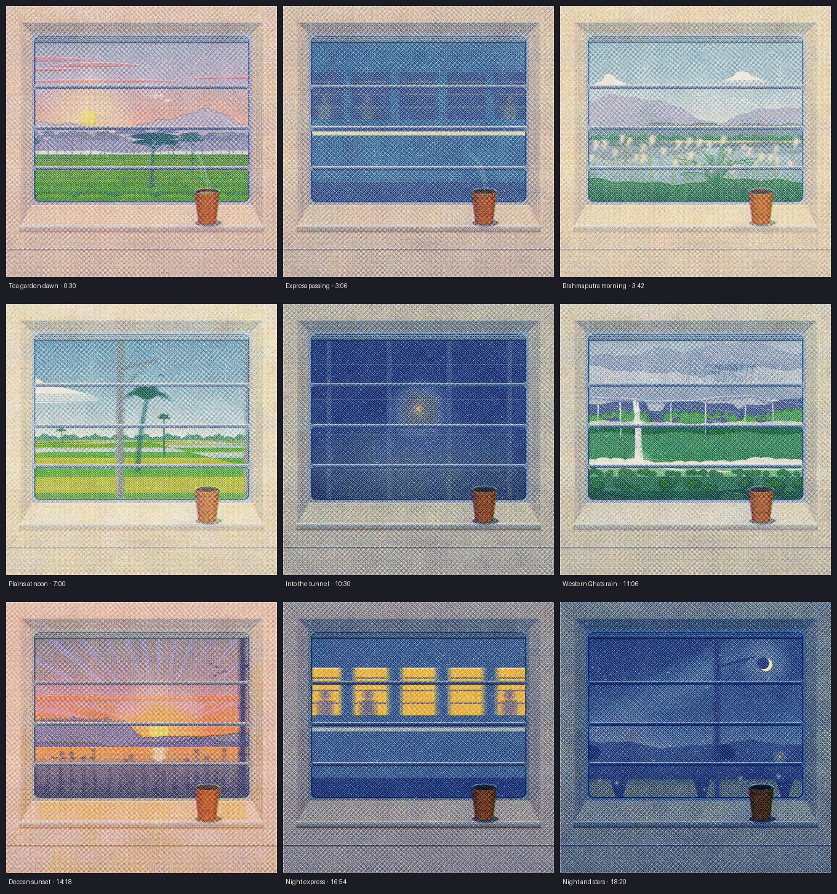

# Purab se Paschim (East to West)

A 20-minute procedural risograph film: one day across India through a sleeper-class window, from an Assam tea garden at dawn to the open country under stars near Pune. Every pixel is Canvas 2D code and every sound is synthesised with Web Audio; no video or image models.

- 1080 × 1080, 30 fps, 20:00, train sound effects only (wheel-over-joint thumps, rolling, window wind, coach rattles, place ambience)
- Six seamless 60 s loops (tea garden dawn, Brahmaputra, plains at noon, Western Ghats rain, Deccan sunset, night) joined by covered transitions (express, goods train, tunnels, night express)
- `source/index.html` is the whole film as one self-contained page (open in a browser; silent there)
- `source/FILM.md` records the design, verification and remaining weaknesses

Built with the engine, tools and craft docs of [sevenevesai/riso-windowseat](https://github.com/sevenevesai/riso-windowseat) (MIT).

## Watch the full film

The film is in `film/` as 15 playable parts (about 80 s each, under GitHub's 100 MB file limit). Download the repo as a ZIP (green **Code** button → **Download ZIP**), then either play the parts in order or join them into one file with ffmpeg:

- Windows: double-click `film/join.bat`
- Mac / Linux: `sh film/join.sh`

Joining uses stream copy, so there is no quality loss: the result is the original 20:00 MP4.

## Live wallpapers (Linux / Fedora)

`wallpapers/` has four seamless 60 s loops at 1920×1080, silent: night, dusk, tea garden, Ghats rain. On Fedora GNOME, install **Hidamari** from Flathub (`flatpak install flathub io.github.jeffshee.Hidamari`), open it, choose a video, and enable autostart.
